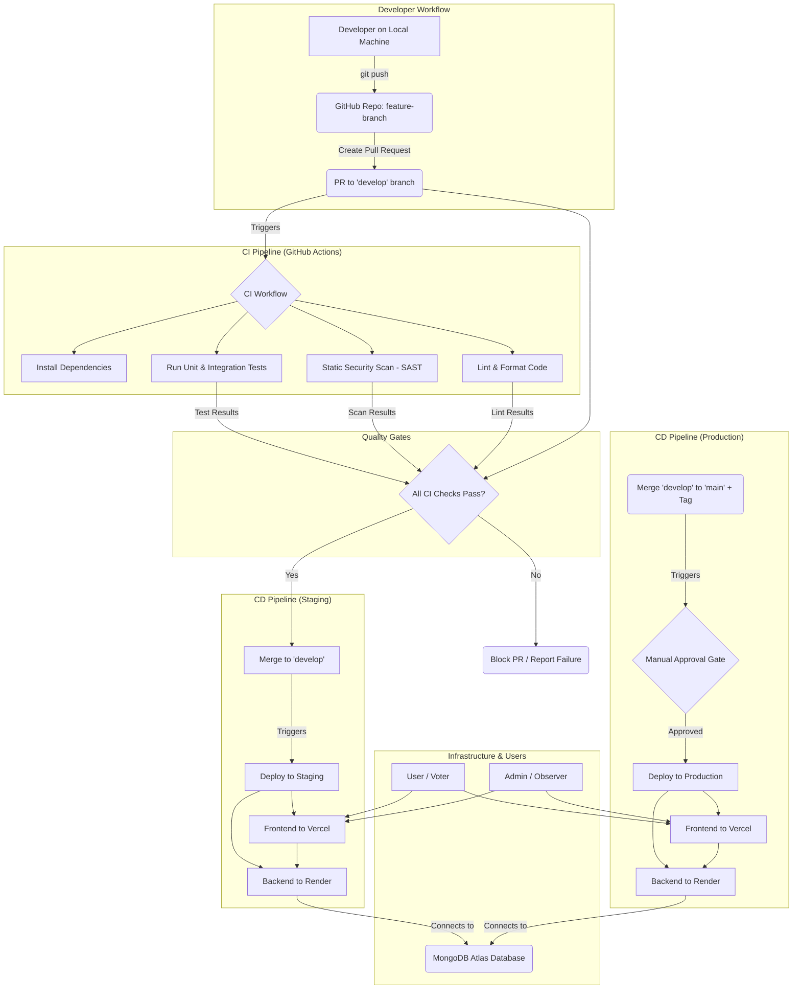

# DevOps Strategy: Secure Electronic Voting System

*   [1. Overview](#1-overview)
*   [2. DevOps Objectives](#2-devops-objectives)
*   [3. System Architecture & CI/CD Diagram](#3-system-architecture--cicd-diagram)
*   [4. Component Breakdown](#4-component-breakdown)
*   [5. Source Code Management Strategy](#5-source-code-management-strategy)
*   [6. CI/CD Workflow](#6-cicd-workflow)
*   [7. Testing & Quality Gates](#7-testing--quality-gates)
*   [8. Deployment & Release Strategy](#8-deployment--release-strategy)
    *   [Frontend](#frontend)
    *   [Backend](#backend)
    *   [Database / Storage](#database--storage)
*   [9. Tools, Platforms, and Libraries](#9-tools-platforms-and-libraries)
*   [10. Future DevOps Roadmap (Upcoming Voting Phases)](#10-future-devops-roadmap-upcoming-voting-phases)
*   [11. Scope & Limitations (What DevOps Will NOT Do)](#11-scope--limitations-what-devops-will-not-do)
*   [12. Conclusion](#12-conclusion)

## 1. Overview

This document provides a comprehensive DevOps strategy for the Secure Electronic Voting System. It details the processes, tools, and architecture required to build, test, secure, and deploy the application in an automated and reliable manner. The focus is on establishing a robust CI/CD pipeline, defining clear quality gates, and creating a transparent, auditable path from code commit to release. This strategy is designed for a project team and assumes a foundational understanding of software development practices.

## 2. DevOps Objectives

The primary objectives of this DevOps strategy are:

*   **Automation:** Eliminate manual steps in building, testing, and deploying to reduce human error and increase efficiency.
*   **Quality & Security:** Integrate automated testing and security scanning into the pipeline as mandatory quality gates to catch issues early.
*   **Reliability:** Create repeatable and consistent deployment processes to ensure system stability.
*   **Traceability:** Maintain a clear and auditable trail for every change, from pull request to production deployment, which is critical for a voting system.
*   **Velocity:** Enable the development team to deliver features and bug fixes to users faster and more frequently.

## 3. System Architecture & CI/CD Diagram

The system comprises a frontend application, a backend API service, and a managed database. The CI/CD workflow, orchestrated by GitHub Actions, automates the process of integrating code changes and deploying them to staging and production environments hosted on Vercel and Render.

## 4. Component Breakdown

This table identifies all major components of the project and outlines their source, deployment target, and validation checks.

| Component                    | Source Code Repository / Directory  | Deployed / Executed On                                                              | Pre-Deployment/Release Validation Checks                                                                   |
| ---------------------------- | ----------------------------------- | ----------------------------------------------------------------------------------- | ---------------------------------------------------------------------------------------------------------- |
| **Frontend Application**     | Root of the repository (`./src/`, `./public/`, `package.json`, etc.) | **Staging/Prod:** Vercel CDN   **Local:** Developer machine                        | Linting, Type Checking, Unit Tests, Successful Build (`vite build`)                                        |
| **Backend Service**          | `/backend/`                         | **Staging/Prod:** Render Web Service   **Local:** Developer machine              | Linting, Unit & Integration Tests, Dependency Vulnerability Scan                                           |
| **Voting Core Service**      | `/voting-core/`                     | **Assumption:** Future deployment on Render. Currently on developer machines only. | Linting, Type Checking, Unit Tests                                                                         |
| **Database**                 | N/A (Managed Service)               | MongoDB Atlas cloud infrastructure                                                  | Connection successful, required indexes exist (checked via backend scripts).                               |
| **CI/CD Pipeline**           | `/.github/workflows/`               | GitHub Actions Runners                                                              | Workflow syntax validation.                                                                                |
| **Installation Script**      | `/backend/setup.sh`                 | **Assumption:** Developer machines (Linux/macOS) or CI runners for setup.           | Manual execution is successful.                                                                            |
| **Frontend Test Suite**      | `/*.test.tsx`, `*.spec.ts`           | CI Runners (GitHub Actions), Developer machines                                     | All tests must pass with a non-zero exit code on failure.                                                  |
| **Backend Test Suite**       | `/backend/tests/`                   | CI Runners (GitHub Actions), Developer machines                                     | All tests must pass with a non-zero exit code on failure.                                                  |
| **Frontend Release Artifact**| N/A (Generated by CI)               | Vercel build environment, then deployed to CDN.                                     | Build must complete successfully, and artifact bundle size should be within reasonable limits (future goal). |
| **Backend Release Artifact** | N/A (Built by Render)               | Render build environment.                                                           | Build must complete successfully based on `requirements.txt`.                                              |

## 5. Source Code Management Strategy

*   **Repository:** A single mono-repository hosted on **GitHub** is used to manage all source code.
*   **Branching Model:** A simplified **GitFlow** model is enforced:
    *   `main`: Represents the stable, production-ready version of the code. Merges only from `develop`.
    *   `develop`: The primary integration branch for all new features. Represents the staging version of the code.
    *   `feature/*`: All new work is done on feature branches, branched from `develop`.
*   **Code Review:** All merges into `develop` or `main` **must** be done via a Pull Request (PR) that is reviewed and approved by at least one other team member. PRs cannot be merged if CI checks fail.

## 6. CI/CD Workflow

The CI/CD workflow is orchestrated entirely by **GitHub Actions**.

1.  **Commit & Pull Request:** A developer pushes code to a `feature/*` branch and opens a PR against the `develop` branch.
2.  **CI Trigger:** The PR creation automatically triggers the CI workflow defined in `.github/workflows/ci.yml`.
3.  **Parallel Jobs Execution:** The workflow runs parallel jobs for the frontend and backend to save time.
    *   **Frontend Job:** Installs Node.js dependencies (`npm install`), runs the linter (`npm run lint`), performs type-checking (`tsc --noEmit`), and executes unit tests (`npm test`).
    *   **Backend Job:** Installs Python dependencies (`pip install`), runs the linter (`flake8`), and executes unit and integration tests (`pytest`).
    *   **Security Job:** A static analysis security testing (SAST) job runs using SonarCloud or Snyk to detect common code vulnerabilities.
4.  **Quality Gate:** The PR is decorated with the status of these checks. GitHub branch protection rules are configured to **block the merge** if any of these jobs fail.
5.  **Merge to `develop`:** Upon successful CI and code review approval, the PR is merged.
6.  **Staging Deployment:** The merge to `develop` triggers a separate CD workflow (`.github/workflows/deploy-staging.yml`), which automatically deploys the latest version of the frontend to Vercel and the backend to Render's staging environment.
7.  **Production Release:** To release to production, the `develop` branch is merged into `main`. A Git tag (e.g., `v1.2.0`) is created and pushed.
8.  **Production Deployment:** Pushing the tag triggers the production deployment workflow (`.github/workflows/deploy-prod.yml`). This workflow contains a **manual approval gate**, requiring a project lead to confirm the deployment within the GitHub Actions UI before the application is released to production users.

## 7. Testing & Quality Gates
---
# 7.1 Backend Testing Strategy (Python / Pytest)

## Environment

- Python 3.11  
- Pytest 9.0  
- SQLite3 (Blockchain-style ledger testing)  
- JWT Authentication with RBAC  

The backend test suite validates both functional correctness and cryptographic integrity.

---

## 1. Double Voting Prevention Test

Objective:  
Enforce a strict 1-to-1 ratio between voters and ballots.

Validation Logic:

- First vote request succeeds.
- Second vote attempt (same JWT / election ID) returns 403 Forbidden.
- The election_voters registry rejects duplicate participation.

Ensures election fairness and prevents ballot duplication.

---

## 2. Hashing Integrity Test (SHA-256 Compliance)

Objective:  
Validate cryptographic correctness.

Validation Logic:

- Backend compute_hash() output is compared against Python’s hashlib.sha256.
- Output consistency ensures compliance with SHA-256 standards.

Guarantees deterministic and tamper-proof hashing.

---

## 3. Blockchain Consistency Test

Objective:  
Verify immutability of the blockchain-style vote ledger.

Validation Logic:

- Each block’s previous_hash must match the preceding block’s block_hash.
- The hash chain is recalculated and validated.
- Any mismatch causes test failure.

Enforces ledger integrity and cryptographic chaining.

---

## 4. Tamper Detection Test

Objective:  
Detect unauthorized direct database manipulation.

Validation Logic:

- A manual tampered entry (e.g., TAMPERED_VOTE) is injected.
- The system recomputes hashes.
- A mismatch is detected and flagged.

Confirms that unauthorized data modification is detectable.

---

# 7.2 API-Level Security & Authentication Testing

The CI pipeline validates complete API flows using integration tests.

---

## 1. Identity Verification (OCR Validation)

Endpoint:  
POST /api/verify-document

Validation:

- Accepts base64 image input.
- Returns success only if keywords such as “IDENTITY”, “INDIA”, or “ELECTION” are detected.

Ensures document-based identity verification before voter registration.

---

## 2. Biometric Registration Test

Endpoint:  
POST /api/register-face

Validation:

- Stores face encoding and phone number.
- Returns status 200 on successful template storage.

Confirms biometric template persistence.

---

## 3. Two-Step Authentication Flow Test

Step A: Face Recognition  
Endpoint: POST /api/recognize-face  
- Triggers OTP generation.

Step B: OTP Verification  
Endpoint: POST /api/verify-otp  
- Valid OTP returns a JWT token.  
- Invalid OTP results in rejection.

Ensures biometric + OTP multi-factor authentication integrity.

---

## 4. Blockchain Vote Casting Endpoint Test

Endpoint:  
POST /api/voter/cast-vote

Validation:

- Requires valid JWT in Authorization header.
- Generates unique block_hash using:
  - Previous block hash
  - Election ID
  - Candidate ID
  - Private PIN (salt)
- Repeated vote attempts return 403 Forbidden.

Ensures:
- Anonymity
- Cryptographic immutability
- Double voting prevention

---

## 5. Admin RBAC Testing

Endpoints:

- POST /api/admin/login
- POST /api/admin/register-voters

Validation:

- Admin login returns JWT with elevated privileges.
- Only admin token can whitelist voter hashes.
- Unauthorized access attempts are rejected.

Ensures strict Role-Based Access Control (RBAC).

---

# 7.3 Frontend Testing Strategy (React / Vitest)

Frameworks & Tools:

- Vitest 4.x
- React Testing Library
- Jest-DOM
- JSDOM environment
- React Router v6/v7

Frontend tests focus on enforcing security at the UI layer.

---

## 1. Auth Guard Protection Test

Objective:  
Prevent unauthorized route access.

Validation Logic:

- Unauthenticated users attempting to access protected routes are redirected to /login.
- ProtectedRoute logic is verified using memory-router simulation.

Prevents unauthorized interface exposure.

---

## 2. Double Submission Prevention Test

Objective:  
Prevent accidental duplicate vote submissions.

Validation Logic:

- Vote button becomes disabled immediately after first click.
- UI state locking is enforced using React useState.

Prevents rapid double-click attacks and duplicate transactions.

---

# 7.4 Static Code & Security Analysis (SAST)

Automated security checks enforced:

- ESLint (Frontend)
- Flake8 (Backend)
- TypeScript type-checking (tsc --noEmit)
- Dependency vulnerability scanning (pip-audit, Snyk)
- Static Application Security Testing (SonarCloud or Snyk)

Pull Requests are blocked if:

- Any linting fails
- Any unit or integration test fails
- Any blockchain integrity test fails
- Any authentication flow test fails
- Any vulnerability scan detects critical issues

---

# 7.5 CI Quality Gate Enforcement

All tests are executed automatically in GitHub Actions on every Pull Request.

A PR is blocked from merging unless:

- Backend unit tests pass
- Blockchain integrity tests pass
- API authentication flow tests pass
- Frontend security tests pass
- SAST and dependency scans pass

This guarantees that no insecure or cryptographically invalid code reaches staging or production.

## 8. Deployment & Release Strategy

### Frontend

*   **Corresponding Source Code:** The frontend code is located across the root directory of the repository, including `src/`, `public/`, and configuration files like `package.json` and `vite.config.ts`.
*   **Deployment Location:** The frontend will be deployed to **Vercel (Free Tier)** as a static site. Separate projects will be configured for Staging (connected to the `develop` branch) and Production (connected to the `main` branch).
*   **Tests or Validation Checks:**
    1.  **Linting:** ESLint will be used to enforce code style and catch common errors.
    2.  **Type Checking:** The TypeScript compiler (`tsc --noEmit`) will be run to ensure type safety.
    3.  **Unit Tests:** Vitest or Jest will be used to run unit tests on individual React components and utility functions.
    4.  **Build Validation:** The application will be built using `vite build` to ensure it compiles successfully.
*   **Tools, Platforms, and Libraries:** Node.js, Vite, TypeScript, React, ESLint, GitHub Actions, Vercel.
*   **Deployment Configuration (Vercel):**
    *   **How to Deploy:**
        1.  **Link GitHub Repository:** Connect your project's GitHub repository to Vercel.
        2.  **Root Directory:** Set this to `./` as the frontend code resides at the repository root.
        3.  **Build Command:** `npm run build` (or `bun run build` if using Bun).
        4.  **Output Directory:** `dist` (this is the default for Vite).
        5.  **Environment Variables:** Configure necessary environment variables (e.g., API endpoint URLs) securely within Vercel's project settings for both Staging and Production deployments.
    *   **Which to Deploy:** The compiled static assets of the Frontend application.
    *   **Where to Deploy:** Vercel's global CDN, with project aliases for Staging (e.g., `project-staging.vercel.app`) and Production (e.g., `project.vercel.app`).

### Backend

*   **Corresponding Source Code:** The backend code is located in the `/backend` directory.
*   **Deployment Location:** The backend will be deployed as a Web Service on **Render (Free Tier)**. Separate services will be configured for Staging and Production.
*   **Tests or Validation Checks:**
    1.  **Linting:** Flake8 or Pylint will be used to enforce PEP 8 standards and check for code smells.
    2.  **Unit/Integration Tests:** Pytest will be used to test API endpoints, business logic, and interactions with the database layer.
    3.  **Dependency Security Scan:** `pip-audit` or the free tier of a tool like Snyk will be used to scan `requirements.txt` for known vulnerabilities.
*   **Tools, Platforms, and Libraries:** Python, Flask, Gunicorn, Pytest, GitHub Actions, Render.
*   **Deployment Configuration (Render):**
    *   **How to Deploy:**
        1.  **Create New Web Service:** In Render, create a new Web Service and link it to your GitHub repository.
        2.  **Root Directory:** Set this to `backend/` to specify the location of your Python application within the monorepo.
        3.  **Runtime:** Select `Python 3`.
        4.  **Build Command:** `pip install -r requirements.txt`.
        5.  **Start Command:** `gunicorn app:app --bind 0.0.0.0:$PORT` (assuming `app.py` is your main Flask app file).
        6.  **Environment Variables:** Configure required environment variables (e.g., `MONGO_URI`, `SECRET_KEY`) securely within Render's service settings for both Staging and Production deployments.
    *   **Which to Deploy:** The Python Flask application and its dependencies.
    *   **Where to Deploy:** Render's web service infrastructure, accessible via Render-provided URLs (e.g., `backend-staging.onrender.com`, `backend-prod.onrender.com`).

### Database / Storage

*   **Corresponding Source Code:** Application-level schema definitions and index management scripts are managed as code within the `/backend` directory.
*   **Deployment Location:** A MongoDB database will be provisioned using **MongoDB Atlas (Free M0 Cluster)**.
*   **Tests or Validation Checks:**
    1.  **Index and Schema Validation:** Scripts to ensure necessary indexes are created and application-level schemas (if enforced) are version-controlled and tested.
*   **Tools, Platforms, and Libraries:** MongoDB Atlas, Pymongo, and custom scripts for index management.
*   **Deployment Configuration (MongoDB Atlas):**
    *   **How to Provision/Deploy:**
        1.  **Create Free Cluster:** Set up a free (M0) cluster on MongoDB Atlas.
        2.  **Network Access:** Configure IP Whitelist entries for the Render web service IPs and any local development IPs.
        3.  **Database User:** Create a dedicated database user with appropriate read/write permissions.
        4.  **Connection String:** Retrieve the connection string (URI) and store it securely as an environment variable (`MONGO_URI`) in Render.
    *   **Which to Deploy:** The MongoDB database itself is a managed service; you are provisioning and configuring it, not deploying code to it.
    *   **Where to Deploy:** MongoDB Atlas's cloud infrastructure (e.g., AWS, GCP, Azure regions).

## 9. Tools, Platforms, and Libraries

This strategy is built exclusively on free-tier services and open-source tools to make it accessible and implementable for a student project.

| Tool / Platform      | Category                      | Why It's Used                                                                                                   |
| -------------------- | ----------------------------- | --------------------------------------------------------------------------------------------------------------- |
| **Git & GitHub**     | Source Control & Management     | Industry-standard version control. GitHub provides repository hosting, PRs, and tight integration with CI/CD. |
| **GitHub Actions**   | CI/CD Platform                | Natively integrated with GitHub, excellent free tier, and a vast marketplace of pre-built actions.              |
| **Vercel**           | Frontend Hosting              | Offers a seamless, Git-native workflow for deploying static frontends with a global CDN and a generous free tier. |
| **Render**           | Backend Hosting               | Simplifies deployment of web services and databases. Connects directly to Git and automates builds.             |
*   **MongoDB Atlas**    | Database-as-a-Service         | Provides a fully managed, scalable MongoDB database with a robust free tier, removing operational overhead. |
| **Node.js / npm**    | Frontend Runtime / Pkg Manager  | Required to run and build the React/Vite frontend and manage its dependencies.                                |
| **Python / pip**     | Backend Runtime / Pkg Manager   | Used to run the Flask backend service and manage its dependencies.                                              |
| **Vite**             | Frontend Build Tool           | A modern, fast build tool for frontend applications that simplifies development and production bundling.      |
| **ESLint / Flake8**  | Linters                       | Enforce code quality and style consistency, catching bugs before they are committed.                            |
| **Vitest / Pytest**  | Testing Frameworks            | Provide powerful and easy-to-use environments for writing and running unit and integration tests.             |
| **SonarCloud / Snyk**| Security Scanning             | Free-tier SAST tools that integrate with CI to automatically detect security vulnerabilities in code and dependencies. |

## 10. Future DevOps Roadmap (Upcoming Voting Phases)

As the project evolves to include sensitive voting and tallying features, the DevOps strategy will also need to mature. Future enhancements will include:

*   **End-to-End (E2E) Testing:** Introduce a framework like **Cypress** or **Playwright** to automate the testing of complete user journeys (e.g., a voter successfully registering, authenticating, and casting a test vote in the Staging environment).
*   **Containerization:** Fully containerize the Python backend and Voting Core services using **Docker**. This will improve portability and environmental consistency, and a `docker-compose.yml` file will be added to simplify local development setup.
*   **Basic Monitoring & Alerting:** Leverage the built-in monitoring and alerting features of Vercel and Render to get basic notifications on application health, suchs uptime status and error rates.
*   **Database Backup Strategy:** Develop and document a process for regularly backing up and testing the recovery of the MongoDB database using MongoDB Atlas's built-in capabilities.

## 11. Scope & Limitations (What DevOps Will NOT Do)

It is important to set realistic expectations for what this DevOps strategy will and will not accomplish, given the constraints.

**What DevOps WILL DO:**
*   Provide a reliable, automated pipeline for building and testing code.
*   Automate deployments to Staging and Production environments.
*   Enforce code quality and security standards through automated checks.
*   Provide visibility and an audit trail for all code changes.

**What DevOps WILL NOT DO:**
*   Guarantee 100% uptime or provide a Service Level Agreement (SLA). The free tiers of hosting platforms have limitations.
*   Perform advanced, dynamic security testing (DAST) or manual penetration testing. These require specialized tools or services.
*   Provide enterprise-grade, centralized logging or application performance monitoring (APM).
*   Automatically manage production incidents or perform auto-scaling under heavy load.

## 12. Conclusion

The adoption of this DevOps strategy will provide the Secure Electronic Voting System project with a robust framework for building, testing, and deploying code in an automated, secure, and repeatable manner. By focusing on free, accessible tools and proven practices, this strategy lays a strong foundation for future development. It will enable the team to deliver high-quality, secure features more efficiently as the project moves into its critical vote-casting and tallying phases, ultimately increasing trust and confidence in the system.